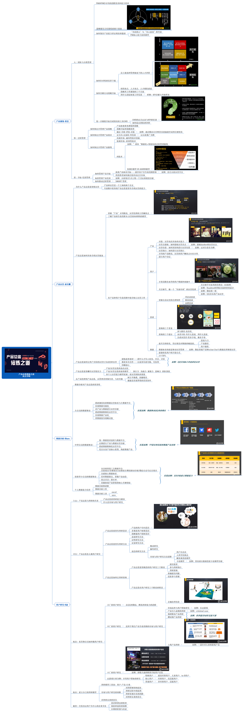

# 序言

## 项目初心

2019年6月15日，我参加了起点学院组织的"产品总监修炼之道"，两天的课，四位讲师，完成了400页的书，将近800张PPT的讲解。

课程结束后，和同学们聊了一下，发现大家和我一样，短时间内吸收如此庞大的信息实在困难。为了让课程的优质内容得意保留，班里8位同学组建了拆书群，希望可以通过复盘的形式，把书中的重点进行总结、吸收，应用到今后的工作中。

## 为什么是Github？

在最初的选择上，我的备选有Gtibook、石墨文档，Gitbook的免费名额有限，所以直接弃用了，而石墨虽然可以多人协同编辑，但属于大家可以同时编辑，对版本的控制比较困难。

于是我想到了使用GItHub，我再体验了Github的协同和版本控制后，觉得这么优秀的软件，只给程序员用实在是太可惜了，所以我也希望在GitHub上有产品经理的影子。

起初使用GitHub的时候会有一定的入门门槛，但用习惯了你就会发现GitHub太好用了。

顺便说一句，如果这份文档可以成功的完成，我会把它导出分享给微信群里的小伙伴。

## 关于Markdown

整个文档使用Markdown进行编辑，第一是我觉得Markdown是产品经理应知应会的技能之一，而且他确实可以帮助我们提升效率；第二是你不觉得会了Markdown就多了一个装逼的理由么？😬

如何使用Markdown这个问题欢迎各位自行百度度娘。

