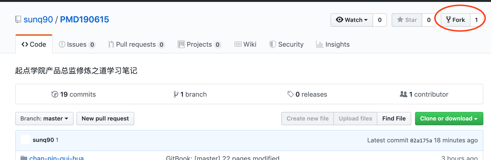
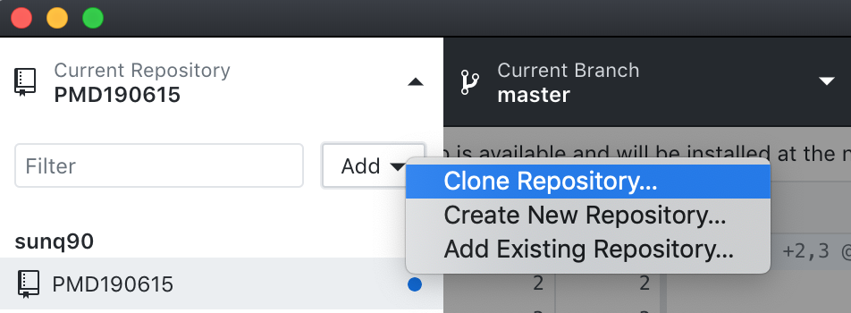
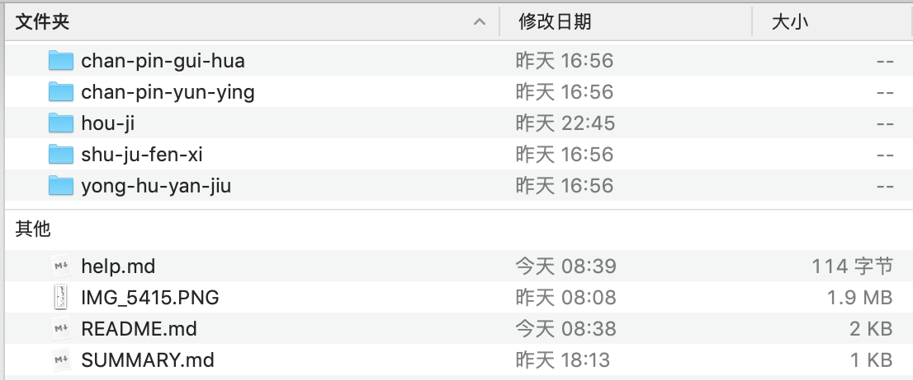
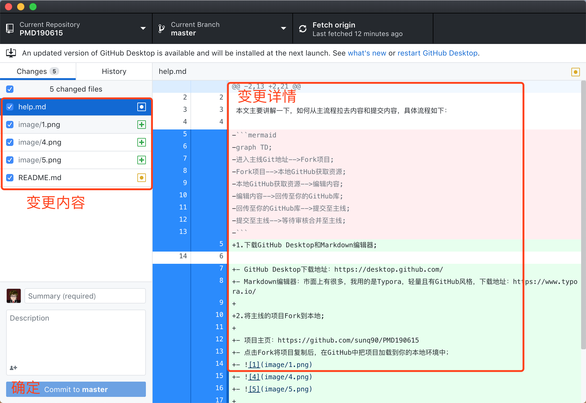
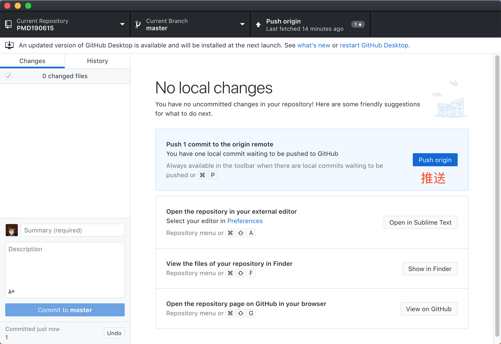
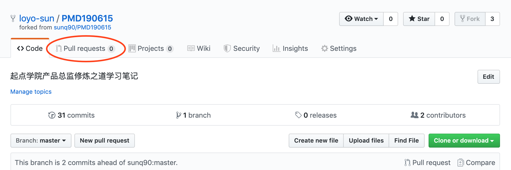
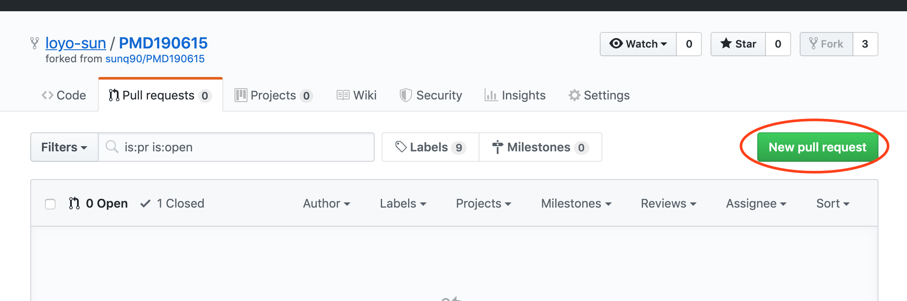
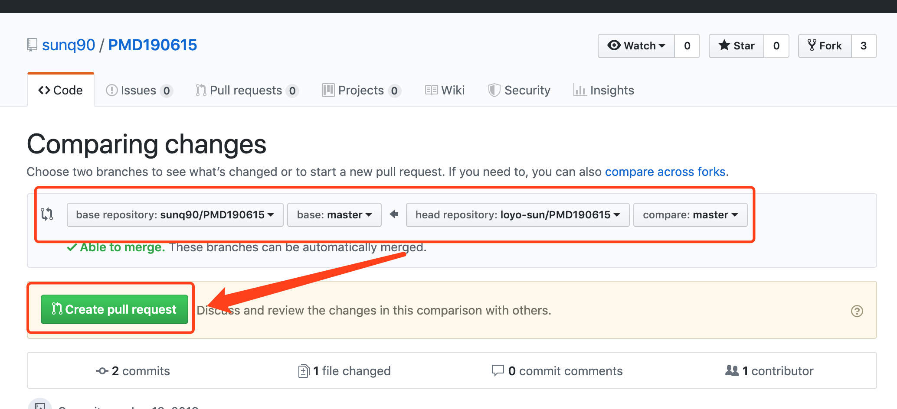
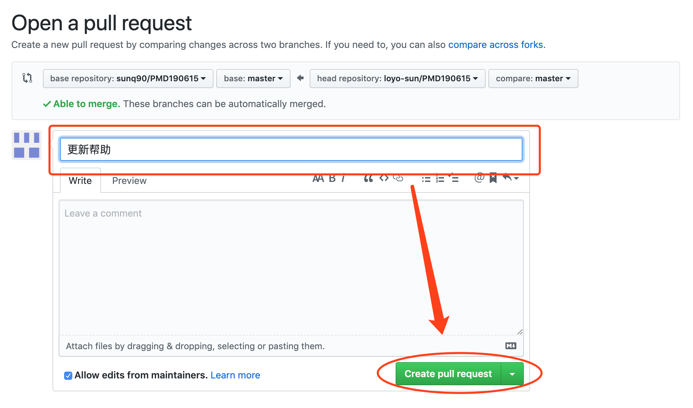
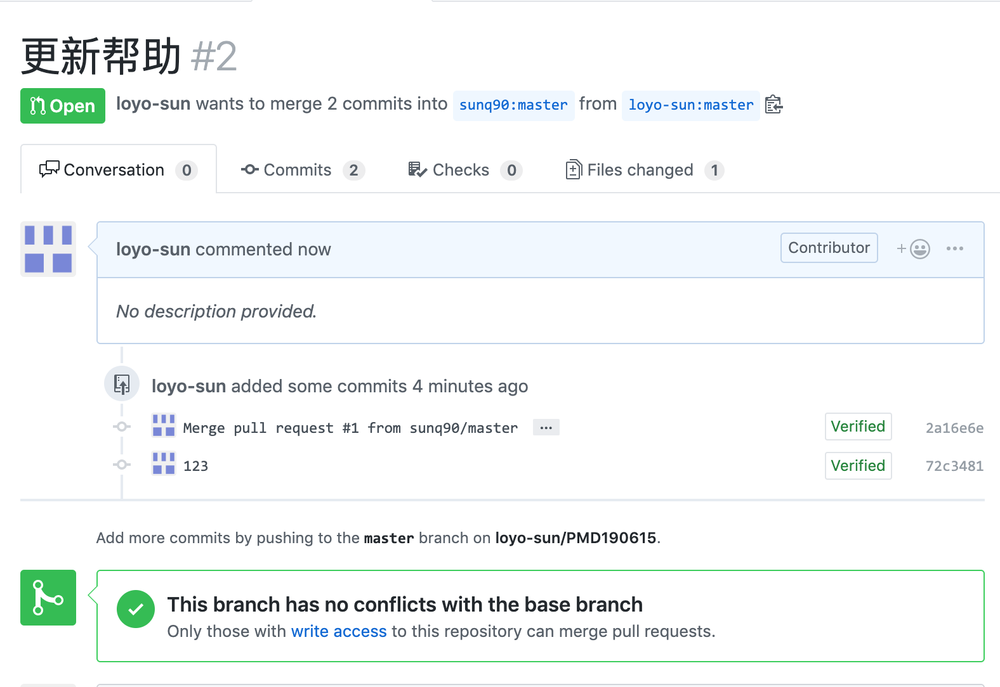

# 使用帮助

## 从主流程拉去、编辑、申请合并内容

环境搭建根据不同的系统、版本等有所不同，出现问题大家可以问我，或者问度娘来解决，我讲的是纯小白可视化操作，如果你自己会通过Git指令来解决，同忽略这个教程。

具体流程如下：

1.下载GitHub Desktop和Markdown编辑器;

- GitHub Desktop下载地址：https://desktop.github.com/
- Markdown编辑器：市面上有很多，我用的是Typora，轻量、免费、直接预览，且有GitHub风格，下载地址：https://www.typora.io/

2.将主线的项目Fork到本地;

- 项目主页：https://github.com/sunq90/PMD190615
- 点击Fork将项目复制后，在GitHub中把项目加载到你的本地环境中；
- 
- 
- 

3.通过Markdown编辑器编辑项目文件;

4.上传至你的GitHub;

- 文件编辑完成之后，会在GitHub Desktop中看到变更内容；
- 
- 核对无误后，将内容推送到你的GitHub中；
- 

5.申请合并;

- 将内容提交至自己的GitHub后，通过pull requests来申请合并数据，不多废话，直接上图了！
- 
- 
- 自己看图去理解吧，想要拉取主线内容和将自己的内容合并到主线，都是酱紫的！
- 
- 
- 
- 这些动作完成之后我会收到合并的请求，我在主线接收后即可完成合并。
